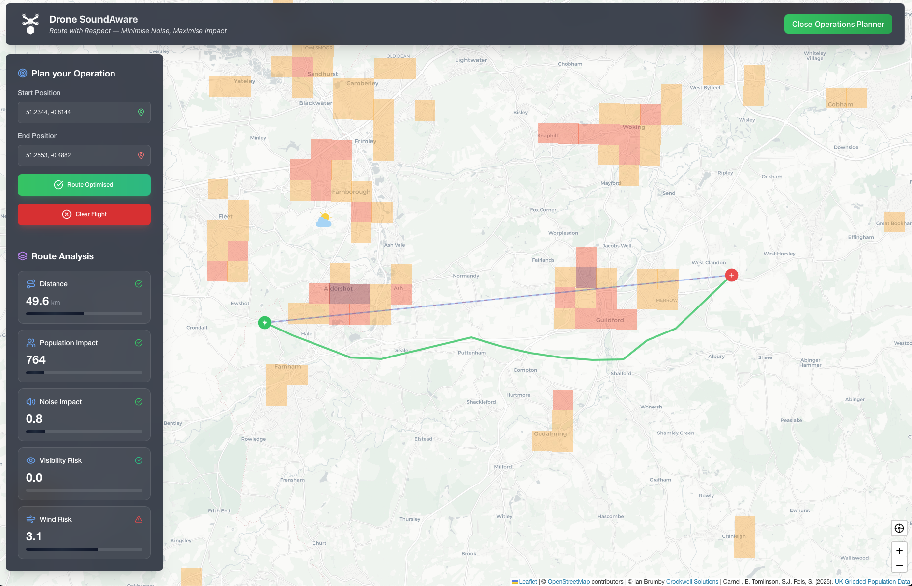

# Drone Delivery Service

Developed for the [AWS Lambda Hackathon 2025](https://awslambdahackathon.devpost.com), this project is a full-stack drone delivery service application that integrates population density data and real-time weather information to optimize drone delivery routes.

AWS Lambda is at the core of this application, providing the compute services needed for real-time data processing and API management.



A live demo of the deployed application is available at [Drone Delivery Service Demo](https://droneplanner.crockwell.com).

[](https://opensource.org/licenses/GPL-3.0)

## 📋 Table of Contents

- [Drone Delivery Service](#drone-delivery-service)
  - [📋 Table of Contents](#-table-of-contents)
  - [🎯 Overview](#-overview)
  - [🏗 Architecture](#-architecture)
  - [ƛ Use of AWS Lambda](#ƛ-use-of-aws-lambda)
  - [🔧 System Prerequisites](#-system-prerequisites)
  - [🚀 The TLDR Getting Started](#-the-tldr-getting-started)
  - [📁 Project Structure](#-project-structure)
  - [💻 Frontend Application](#-frontend-application)
  - [🛠 Backend Application](#-backend-application)
    - [Local Development and Debugging](#local-development-and-debugging)
    - [Testing](#testing)
  - [🚢 Deployment](#-deployment)
  - [🌐 Backend REST API](#-backend-rest-api)
  - [💰 Costs](#-costs)
  - [🗑️ Cleanup](#️-cleanup)
  - [📊 Data Sources](#-data-sources)
    - [Population data](#population-data)
    - [Weather data](#weather-data)
  - [📄 License](#-license)

## 🎯 Overview

The Drone Delivery Service is a full-stack application that helps plan and optimize drone delivery routes by providing critical data visualization and analysis tools. It combines population density data with real-time weather information to assist in drone delivery planning.

**The application uses a global weather dataset, but for demonstration purposes, the population data is limited to the UK. This allows the application to deploy in a reasonable timeframe as the population data is loaded on deploy.**

## 🏗 Architecture

The platform consists of three main components:

- **Frontend**: React-based web application served via CloudFront. Deployed with AWS CDK.
- **Backend**: Serverless API built with AWS Lambda and API Gateway, using DynamoDB for data storage and event driven architecture for real-time updates. Deployed with AWS CDK.

The overall architecture is shown below:


AWS services consist of:
- AWS Lambda for serverless compute
- Amazon DynamoDB for data storage and event-driven architecture
- Amazon S3 for static hosting
- Amazon CloudFront for content delivery
- AWS API Gateway for REST API management
- AWS AppSync Events for real-time websocket communication

## ƛ Use of AWS Lambda

AWS Lambda sits at the heart of the application. Lambda functions are used for three main purposes with three different trigger types:

1. **Scheduled Data Loading**: A Lambda function processes data from weather stations and stores it in DynamoDB. This is triggered by an Eventbridge Scheduled Event, running every hour to bring in the latest weather data.
2. **API Management**: Lambda functions handle API requests, providing endpoints for the frontend to fetch data and perform operations.
3. **Event Driven**: A Lambda function is triggered by INSERTS into a DynamoDB table, allowing for real-time updates to the frontend when new data is added, making use of AWS AppSync Events for websocket communication.

## 🔧 System Prerequisites

Before you begin, ensure you have the following prerequisites installed and configured on your local machine:
- Node.js
- npm (latest stable version)
- AWS CLI configured with appropriate credentials, connected to a valid AWS account
- AWS CDK CLI (`npm install -g aws-cdk`)
- A bootstrapped AWS environment in the desired region (e.g., `eu-west-1`): `cdk bootstrap --region eu-west-1`
- AWS SAM CLI (for local development)

## 🚀 The TLDR Getting Started

1. **Clone the repository**
   ```bash
   git clone [repository-url]
   cd drone-delivery-service
   ```

2. **Install dependencies**
   ```bash
   npm install
   ```

3. **Deploy the application (Frontend and Backend)**
   ```bash
   npm run deploy
   ```

> Note: Initial deployment includes data seeding and may take several minutes. This is a one-time setup step.

> Note: running npm run deploy will deploy the backend and the frontend of the application. These are technically two different CDK applications. More details of the deployment process can be found in the [Deployment](#-deployment) section.

Following deployment, the frontend application will be available at the CloudFront URL outputted in the terminal. The backend API will also be available, and the frontend will automatically connect to it.

## 📁 Project Structure

```bash
.
├── bin/                   # CDK app entry points (backend and frontend)
├── config/                # Environment configurations
├── frontend/              # React frontend application. Used to demonstrate the backend API
├── lib/                   # CDK infrastructure code
│   ├── constructs/        # Reusable CDK constructs
│   ├── stateful/          # Stateful resource stacks (DynamoDB)
│   └── stateless/         # Stateless resource stacks (Lambda, API Gateway) - Uses nested stacks
│   └── frontend/          # Frontend resource stacks (S3 and CloudFront)
├── src/                   # Lambda function source code
└── test/                  # Test files and test payloads for locally invoking Lambda functions
```

## 💻 Frontend Application

The frontend application is built using React and Tailwind CSS, providing a interactive user interface for visualizing population density and weather data. This has been built for the purposes of demonstrating the system backend and is not intended for production use. It has the following features:

- Population density visualization
- Weather station data display
- Interactive map controls
- Route planning for drone deliveries
- Route optimization based on population density and weather conditions

To run locally:
```bash
cd frontend
npm install
npm start
```

The frontend running locally will connect to the deployed backend API, which is configured with an output of the backend CDK deployment and written to the `frontend/src/cdk-output.json` file.

## 🛠 Backend Application

### Local Development and Debugging

It is possible to run and debug the backend Lambda functions locally using the AWS SAM CLI. This allows you to test Lambda functions and API Gateway endpoints without deploying to AWS.

For VSCode users, the launch configurations are provided in `.vscode/launch.json`. This allows you to run and debug Lambda functions locally with breakpoints and logging.

1. Install AWS SAM CLI
2. Ensure the backend is deployed at least once to create the necessary resources (see [Deployment](#-deployment) section)
3. Create a `local.env.json` file in the root of the project, based on the parameters in the `local.env.example.json` file. This file should contain the environment variables required for local development, such as API keys and DynamoDB table names.
4. Use VSCode debugging configurations in `.vscode/launch.json`
5. Run Lambda functions locally for testing

### Testing
```bash
npm run test    # Run unit tests
npm run lint    # Run linting
```

## 🚢 Deployment

The project uses the awesome CDK project (in Typescript) for infrastructure definition and deployment.

The deployment is split into two CDK projects:
- **Backend**: Contains the stateless and stateful stacks. The command `npm run deploy:backend` will deploy the backend CDK stacks. Following completion of the backend deployment, it will output the necessary API Gateway endpoint URLs to the `cdk-output.json` file in the `frontend/src` directory. This file is used by the frontend application to connect to the backend API.
- **Frontend**: Contains the static hosting stack. The command `npm run deploy:frontend` will build the frontend React application and deploy the frontend application to an S3 bucket and configure CloudFront for content delivery.

To deploy the entire application, you can run `npm run deploy` which will run both the backend and frontend deployments sequentially.

## 🌐 Backend REST API

Following deployment, the backend API will available at:
```bash
https://[api-id].execute-api.[region].amazonaws.com/prod/
```

It is secured with an API key, which is generated during the deployment process. The API key is required for all requests to the backend.

Key endpoints:
- `/spatial/bounding-box` - Get population data within map bounds
- Parameters:
  - `latMin`: Minimum latitude
  - `lonMin`: Minimum longitude
  - `latMax`: Maximum latitude
  - `lonMax`: Maximum longitude

- `/routes/assess-route` - Assess a drone delivery route
- Parameters:
  - `latStart`: Starting latitude
  - `lonStart`: Starting longitude
  - `latEnd`: Ending latitude
  - `lonEnd`: Ending longitude

- `/routes/optimise-route` - Optimize a drone delivery route. This is an asynchronous operation that returns a job ID. The results are processed and an AppSync Event is triggered when the job is complete.
- Body:
  ```json
  {
    "startPoint": {
      "lat": 0.0,
      "lon": 0.0
    },
    "endPoint": {
      "lat": 0.0,
      "lon": 0.0
    },
  }
  ```

## 💰 Costs

The application is full serverless and uses various AWS serverless services, which may incur costs based on usage. The main ongoing cost driver is the loading of Weather Station data, which is scheduled to run every hour. This consumes approximately 3.6 million Write Capacity Units (RCUs) per month, which is approximately $2.50 per month at the time of writing. Total costs including Lambda and Cloudwatch should not exceed $5 per month for low usage. For ongoing use, provisioned mode should be considered for the DynamoDB table to reduce costs.

## 🗑️ Cleanup

To clean up the deployed resources, run:
```bash
npm run destroy
```

## 📊 Data Sources

### Population data

The population density data is provided by the UK Government through the UK open data source initiative [(data.gov.uk)](https://data.gov.uk)
- Coverage: ~800,000 data points across the UK at 1km resolution
- License: Commercial and non-commercial use permitted
- Reference: Carnell, E., Tomlinson, S.J., Reis, S. (2025). UK gridded population at 1 km resolution for 2021 based on Census 2021/2022 and Land Cover Map 2021. NERC EDS Environmental Information Data Centre https://doi.org/10.5285/7beefde9-c520-4ddf-897a-0167e8918595

### Weather data
Weather data is sourced from National Oceanic and Atmospheric Administration (NOAA) and covers a global dataset of Weather Data from Airfields (METARs).
- Coverage: Global
- License: Commercial and non-commercial use permitted

## 📄 License

This project is licensed under the GNU General Public License v3.0 [](https://opensource.org/licenses/GPL-3.0) - see the LICENSE file for details.